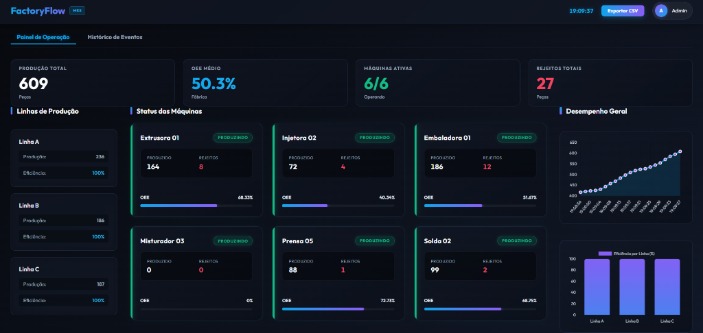
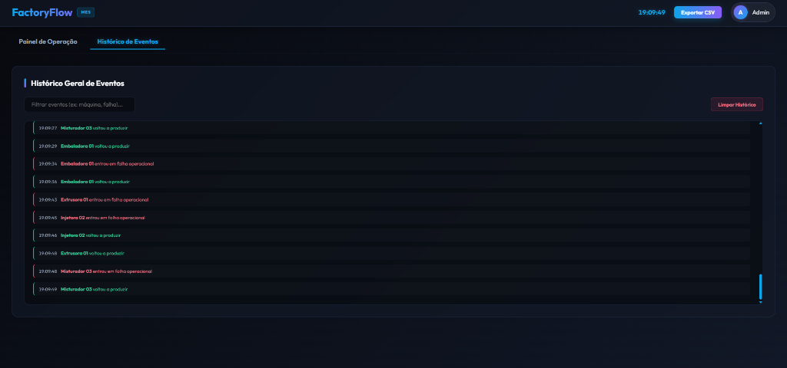

# FactoryFlow — Sistema MES Focado em Produção Industrial 🏭📊

<p align="left">
  
  
  
  
  
  
  
</p>

**FactoryFlow** é um sistema **MES (Manufacturing Execution System)** moderno e responsivo, desenvolvido para monitoramento, controle e auditoria de processos produtivos industriais em tempo real.

⚡ **Acesse a Demonstração Online**: [https://factory-flow-mes.vercel.app/](https://factory-flow-mes.vercel.app/)

---

## 📸 Demonstração Visual

| 1. Painel de Operação (Dashboard) | 2. Histórico de Eventos (Logs) |
| :---: | :---: |
|  |  |

---

## ⚡ Funcionalidades Chave

- **Monitoramento em Tempo Real ⏱️**: Acompanhamento dinâmico do estado das máquinas (Produzindo, Parada, Manutenção, Setup), velocidade operacional e operador logado.
- **Motor de OEE Dinâmico 📊**: Cálculo segundo a segundo dos índices de OEE (*Disponibilidade, Performance e Qualidade*) para cada linha de produção.
- **Gráficos Históricos Dinâmicos 📈**: Análise visual integrada usando **Chart.js** para monitorar a quantidade de peças produzidas por hora e a eficiência geral da planta.
- **Simulador de Processo Industrial 🛠️**: Emulador assíncrono que gera eventos dinâmicos na fábrica, como oscilações de velocidade, paradas de linha e rejeição de peças para auditoria realista.
- **Auditoria & Logs 📝**: Painel dedicado para visualização cronológica detalhada de todos os eventos gerados pela planta industrial.
- **Design Premium Glassmorphism 🎨**: Interface futurista de alto nível visual, totalmente responsiva e projetada com Vanilla CSS, micro-animações dinâmicas e transições suaves.

## 🛠️ Tecnologias Utilizadas

- **Frontend**: HTML5, Vanilla CSS3 (Glassmorphism), JavaScript Puro (ES6) e **Chart.js** para gráficos e métricas industriais dinâmicas.
- **Backend**: Python 3.10+, **FastAPI** e **Uvicorn** para gerenciamento de conexões WebSocket assíncronas e robustas.
- **Arquitetura**: Comunicação orientada a eventos assíncronos usando **Asyncio** de alto desempenho.

---

## 🚀 Como Rodar o Projeto Localmente

### 1. Iniciar o Backend (FastAPI + Uvicorn)
No terminal, dentro do diretório do projeto:
```bash
cd backend
pip install -r requirements.txt
python main.py
```
*O servidor de sockets estará ativo na porta `8050`.*

### 2. Iniciar o Frontend
Em outro terminal:
```bash
cd frontend
python -m http.server 8080
```
*Acesse o dashboard no seu navegador em: [http://localhost:8080](http://localhost:8080)*

---

## 🌐 Guia de Deploy em Produção (Nuvem)

### 1. Frontend (Hospedagem na Vercel)
A **Vercel** é ideal para o frontend estático:
1. Conecte seu repositório GitHub ao painel da Vercel.
2. Importe o projeto e selecione a pasta `/frontend` como **Root Directory** nas configurações.
3. Clique em **Deploy** e pronto!

### 2. Backend (Hospedagem no Render ou Railway)
Por necessitar de conexões persistentes abertas de segundo plano, o backend Python deve rodar em um serviço de execução contínua:
1. Crie um novo *Web Service* (no Render ou Railway) conectando seu repositório.
2. Defina o diretório de execução como `/backend` e o comando de inicialização como `python main.py`.

### 3. Conexão entre os Ambientes
O sistema já está totalmente integrado e pré-configurado no arquivo `app.js` para se comunicar com o backend de produção ativo no Render:
`wss://factoryflow-mes.onrender.com/ws`

---

## 🎓 Conclusão
O **FactoryFlow** demonstra competências sólidas em **Desenvolvimento Real-Time (WebSockets)**, **Simulações Orientadas a Eventos (Asyncio)**, **Cálculos Industriais (OEE)** e **UX/UI futurista premium de alta performance**.🚀
